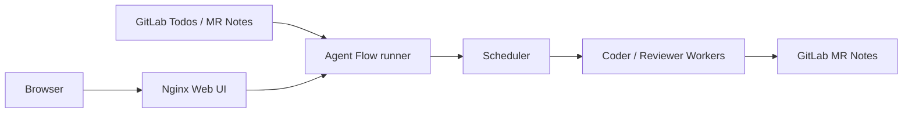

# Agent Flow：GitLab Todo 驅動的本地 AI 多代理編排器

[Docker 啟動](#快速啟動) · [疑難排解](#疑難排解)

Agent Flow 是一個以 Go 實作的本地多代理編排器。它會輪詢 GitLab Merge Request 的 Todos，將工作分派給 Coder 與 Reviewer 等 AI Agent，並以 GitLab 留言驗證任務結果。適合想在自己的 Docker 環境中整合 Codex、Claude Code、Agy、tmux 與 GitLab 自動化流程的團隊。

## 解決什麼問題？

- 讓 GitLab Todo 成為 AI code review 與修正任務的入口。
- 在一個 Docker Compose 啟動流程中同時提供 Web 控制台、排程器與 Workers。
- 讓 Coder 只處理最新審查結論要求修正的 MR，避免誤觸發自動修改。
- 只有當 Agent 留下符合角色格式的新 GitLab 留言時才結案，避免「CLI 看似完成、實際沒有回覆 MR」的假成功。
- 為 Reviewer、Coder、Codex、Claude Code 與 Agy 保留獨立的 tmux 工作階段與設定。

## 架構



`docker compose up --build` 會啟動兩個容器：

- `agent-flow`：提供 API、輪詢 GitLab Todos、執行 tmux Workers。
- `web`：提供控制台並將 `/api/` 代理至 `agent-flow:8081`。

## 快速啟動

### 前置條件

- Docker 與 Docker Compose
- 可存取 GitLab API 的 Token
- 已登入的 Codex 認證目錄：`~/.codex`
- 欲讓 Agent 操作的宿主專案位於 `${HOME}/projects`；它會掛載到容器內的 `/workspace`
- 若使用 Agy，提供可執行檔；預設位置為 `${HOME}/.local/bin/agy`

### 啟動

```bash
docker compose up --build
```

開啟 <http://127.0.0.1:8080>，依序：

1. 在「管理設定」儲存 GitLab URL、輪詢間隔、允許專案與 MR 作者。
2. 新增 Agent，填入 ID、指令、GitLab Token 與容器內工作目錄。
3. 例如宿主的 `${HOME}/projects/my-service`，工作目錄填 `/workspace/my-service`。

設定會保存於 `data/settings.yaml`，重啟容器後仍會保留。

### 常用 Agent 範例

| 角色 | ID | 指令 | 用途 |
| --- | --- | --- | --- |
| Reviewer | `reviewer` | `agy`、`claude` 或 `codex` | 撰寫 MR 審查結論 |
| Coder | `coder` | `codex` 或 `claude` | 依最新審查意見修正同一個 MR 分支 |

Coder 只會在最新審查結論含有「需修改後再審」時接收任務。完成後必須在 MR 留下 `## 修正回覆`；Reviewer 則使用 `## 審查結論`（相容舊格式 `### 結論`）。

## Web 控制台

控制台會顯示每個 Agent 的 ID、指令、工作目錄與目前狀態：

- 綠色：待命中。
- 紫色：執行任務中。
- 灰色：已停止。
- 成功、資訊、警告與錯誤訊息分別以綠、藍、橘、紅區分。

Web UI 不會回傳或顯示 GitLab Token。

## 疑難排解

### Web UI 的 `/api/agents` 回傳 502

確認兩個服務都在執行：

```bash
docker compose ps
```

應同時看到 `agent-flow` 與 `web`。再測試 API：

```bash
curl --fail --silent http://127.0.0.1:8080/api/agents
```

若 `agent-flow` 未啟動，查看其日誌：

```bash
docker compose logs --tail=100 agent-flow
```

### Agent 顯示已停止或無法啟動

- 確認 Agent 指令在容器內可用，例如 `codex`、`claude` 或 `agy`。
- 確認 Codex 認證已掛載到 `/root/.codex`。
- 確認工作目錄使用容器路徑 `/workspace/...`，而不是宿主絕對路徑。
- 查看 runner 日誌與 tmux session：

```bash
docker compose logs --tail=100 agent-flow
docker compose exec agent-flow tmux ls
```

### Agy 不在預設位置

```bash
AGY_BIN=/path/to/agy docker compose up --build
```

## 開發

```bash
go test ./... -count=1
go fmt ./...
go vet ./...
docker compose config
```

專案核心位於 `internal/orchestrator`；GitLab API client 位於 `internal/gitlab`；Web UI 位於 `internal/orchestrator/web/index.html`。

## 安全性與操作提醒

- 將 `data/` 與任何含 Token 的設定檔保留在版本控制之外。
- 僅掛載 Agent 實際需要操作的 workspace。
- 允許專案與 MR 作者白名單可縮小自動派工範圍。
- 對外使用前，請將 Web port 限制於可信任網路。

## 授權

請參閱 [LICENSE](LICENSE)。
