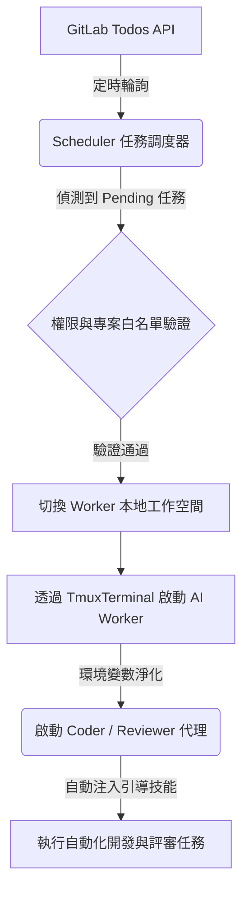

# Agent-Flow: 基於 Go 語言的本地多 AI 代理協作與 GitLab 任務編排器 (Multi-Agent Orchestrator)

[](https://golang.org)
[](LICENSE)

`agent-flow` 是一個專為 Go 開發者與 DevSecOps 團隊設計的本地多 AI 代理 (Multi-Agent) 協作編排器。透過整合 **GitLab Todos API** 與 **tmux 終端適配器**，本專案能自動定時掃描 GitLab 上的待辦任務，動態調度並啟動本地端的 AI Worker（如 Coder 與 Reviewer 代理），在完全隔離的沙盒環境中執行代碼生成、重構與自動化代碼評審 (AI Code Review) 任務。

---

## 🎯 核心功能與技術優勢

*   **🚀 多代理本地調度 (Local Multi-Agent Orchestration)**：利用本地 `tmux` 終端多路復用技術，獨立運行並維護多個 AI Worker 實體，完全無需依賴繁重的容器化環境。
*   **📬 GitLab Todos API 自動輪詢**：主動式任務驅動，自動定時掃描被指派或提及的 GitLab 待辦事項 (Todos)，實現任務的即時接收與處理。
*   **🔒 環境變數沙盒隔離 (Process Sandbox Isolation)**：內建嚴格的環境變數過濾機制（自動清除 IDE 宿主變數如 `VSCODE_` 與 `remote-cli`），確保 AI CLI 啟動的純淨性與穩定性。
*   **🛠️ 自動技能注入 (Automatic Skill Injection)**：支援對 AI 代理自動載入並執行特定的引導技能（例如 `senior-coder-workflow` 或 `git-mr-workflow-reviewer`），極速完成初始化引導。
*   **📂 動態工作空間切換 (Dynamic Workspace Switching)**：根據 GitLab Merge Request 所關聯的專案，自動同步切換 Worker 的本地工作目錄，無縫執行代碼測試與分析。

---

## 🧱 系統架構設計

以下為 `agent-flow` 的核心任務調度與 Worker 執行流程：



---

## 🛠️ 快速啟動

目前的 `configs/config.yaml` 僅設定服務啟動項目：`listen_addr`、`logs.path` 與 `settings_path`。GitLab、輪詢規則與所有 agent 均在服務啟動後透過 `http://127.0.0.1:8080` 設定，並持久化到 `data/settings.yaml`。

### 1. 系統需求
*   **Go** 1.21 或以上版本
*   **tmux** (Linux 系統終端多路復用器)
*   **Antigravity CLI / Codex CLI**（已安裝且設定於環境變數中）

### 2. 安裝與設定
複製範例設定檔，並填入您的 GitLab API Access Token 與專案配置：

```bash
cp configs/config.yaml.example configs/config.yaml
```

編輯 `configs/config.yaml` 進行客製化調整：
```yaml
gitlab:
  url: "https://gitlab.example.com"
  token: "YOUR_PERSONAL_ACCESS_TOKEN"

workers:
  coder:
    cmd: "codex"
    workspace: "/home/user/projects/workspace-coder"
  reviewer:
    cmd: "/home/user/.local/bin/agy"
    workspace: "/home/user/projects/workspace-reviewer"
```

### 3. 啟動編排器服務
```bash
make start
```
這會在背景啟動排程監聽器，並在獨立的 tmux session 中初始化對應的 AI Workers。

### Docker 啟動

容器會安裝 `codex` 與 `claude`，並掛載宿主的專案目錄到 `/workspace`、Codex 認證到 `/root/.codex`，以及宿主的 Agy binary。先確認已登入 Codex，然後執行：

```bash
docker compose up --build
```

開啟 `http://127.0.0.1:8080`，在 Web 頁面新增 agent。工作目錄要填容器內路徑，例如 `/workspace/your-project`；Agy 預設掛載 `${HOME}/.local/bin/agy`，可用 `AGY_BIN=/path/to/agy docker compose up --build` 覆寫。

---

## 📋 終端管理命令 (Makefile)

專案提供完整的 Makefile 工具鏈，便於您即時監控與偵錯：

| 命令 | 說明 |
| :--- | :--- |
| `make start` | 啟動本地多代理編排服務與監聽排程 |
| `make stop` | 停止所有運作中的 AI Worker 實體並清理 tmux 會話 |
| `make status` | 檢視當前所有運作中的 AI Worker 狀態 |
| `make logs` | 監看編排器的即時運作日誌 |
| `make attach-c` | 連接並監看 Coder Worker 的即時互動畫面 (`tmux attach`) |
| `make attach-r` | 連接並監看 Reviewer Worker 的即時互動畫面 (`tmux attach`) |

---

## 📐 專案目錄結構

```text
├── cmd
│   └── agent-flow          # 程式進入點與 GitLab 排程監聽邏輯
├── configs
│   ├── config.yaml         # 本地運作設定檔（GitLab API 與 Worker 設定）
│   └── config.yaml.example # 設定檔範例模板
├── internal
│   └── orchestrator        # 核心編排邏輯（Worker 管理、Tmux 適配、GitLab API 對接）
├── logs                    # AI Worker 的對話紀錄與執行日誌
└── Makefile                # 專案生命週期管理腳本
```

---

## 🤝 開發規範與禁忌

所有對本專案進行貢獻的開發者，請務必遵循 [GEMINI.md](GEMINI.md) 中的開發規範：
1.  **效能至上**：嚴禁在頻繁呼叫的函式內部使用 `regexp.MustCompile`，請將其提取為 Package 層級的常駐變數。
2.  **變更一致性**：若修改了資料過濾機制，須同步檢查同領域的 `List`、`Get` 與 `Options/Dropdown` 相關實作。
3.  **註解規範**：嚴格禁止「標籤式註解」（如 `// 1. 準備數據`）。註解應闡述「為什麼這樣做」，而非「正在做什麼」。
4.  **本地驗證**：提交任何變更前，必須在本地完成 `go fmt`、`go vet` 以及單元測試。
