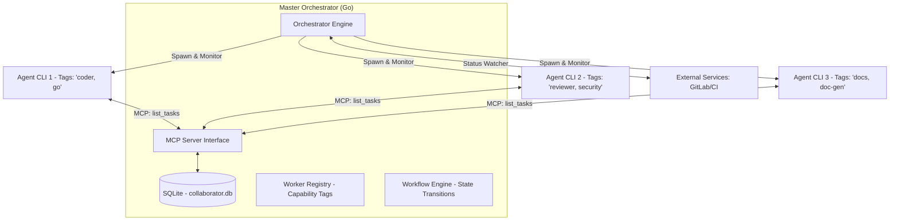

# 設計規格：通用型本地 AI 協作編排平台 (Gemini Collaborator Engine)

## 0. 專案概述
`gemini-collaborator-go` 是一個以 Go 語言開發的通用型本地任務編排器。它提供了一個「訊息中轉站」與「狀態機引擎」，讓多個具備不同能力的 Gemini CLI 實體（Workers）能根據任務標籤（Tags）自動領取、處理並流轉工作。Coder 與 Reviewer 的協作僅是其內建的首個應用情境。

## 1. 系統架構：標籤路由與子程序管理
系統採用「工作者模型 (Worker Model)」，所有的子程序（CLI）都向中心化的編排器註冊，並根據其具備的標籤來匹配任務。



## 2. 資料模型：通用任務池 (Job Pool)

### `tasks` 核心表
| 欄位名 | 型別 | 描述 |
| :--- | :--- | :--- |
| `id` | UUID (PK) | 唯一識別碼 |
| `workflow_id` | STRING | 所屬工作流類型 (如 'standard_dev', 'doc_gen') |
| `status` | STRING | 內部狀態 (如 'PENDING', 'IN_PROGRESS', 'WAITING_CI') |
| `target_tags` | JSON / TEXT | 領取該任務所需的標籤 (如 '["coder", "go"]') |
| `payload` | JSON | 攜帶的對象與上下文 (如 MR_ID, Repository, Code context) |
| `result` | TEXT | 執行結果或 Feedback (存儲通用的執行摘要) |
| `history` | JSON | 完整的狀態流轉日誌 (Audit Log) |

## 3. 彈性工作流定義 (Workflow Engine)
工作流定義了狀態之間的跳轉規則與目標標籤：

- **情境：開發審核循環 (Standard Dev Cycle)**
  - `IDLE` --(Tags: "coder")--> `IN_PROGRESS`
  - `IN_PROGRESS` --(Submit MR)--> `AWAITING_CI`
  - `AWAITING_CI` --(GitLab Pass)--> `READY_FOR_REVIEW` (Tags: "reviewer")
  - `READY_FOR_REVIEW` --(Feedback)--> `REVISING` (Tags: "coder")
  - `READY_FOR_REVIEW` --(Approve)--> `FINISHED`

## 4. MCP 通用工具介面 (Generic Tool Interface)
為了保持彈性，代理人呼叫的工具不應帶有角色名稱：

- `register_worker(tags [])`: 子程序啟動後向 Master 註冊。
- `poll_available_tasks(myTags [])`: 領取匹配標籤且狀態正確的任務。
- `update_task_execution(taskId, resultPayload, nextStatus)`: 回報進度或要求狀態轉移。
- `read_task_context(taskId)`: 獲取該任務在 GitLab/檔案系統或其他服務的完整上下文。

## 5. GitLab & CI 插件 (Context Connector)
核心編排器可以透過「適配器 (Adapter)」監控外部狀態：
- **GitLab 適配器**：負責監測特定 `task.payload.mr_iid` 的 Pipeline 與 Comments。
- **未來適配器**：Jira 單號追蹤、Telegram 通知轉發、本地檔案變動監控。

## 6. 配置範例 (config.yaml)
```yaml
# 定義通用的協作實體
collaborators:
  - id: "dev-agent-1"
    cmd: "gemini-cli"
    args: ["--mode", "agent"]
    tags: ["coder", "golang", "test-gen"]
    env: { "GITLAB_TOKEN": "$GL_TOKEN" }
  
  - id: "review-agent-1"
    cmd: "gemini-cli"
    args: ["--mode", "agent"]
    tags: ["reviewer", "security"]
```

## 7. 專案價值與成功指標
- **可擴展性**：新增協作角色只需在 `config.yaml` 增加 Tags 設定與新的子程序。
- **一致性**：所有代理人的交互歷史與狀態切換皆留存在 SQLite 中，用於後續審計。
- **自動化閉環**：大幅減少人類在不同 AI 之間「手動搬運」上下文與狀態的時間。
