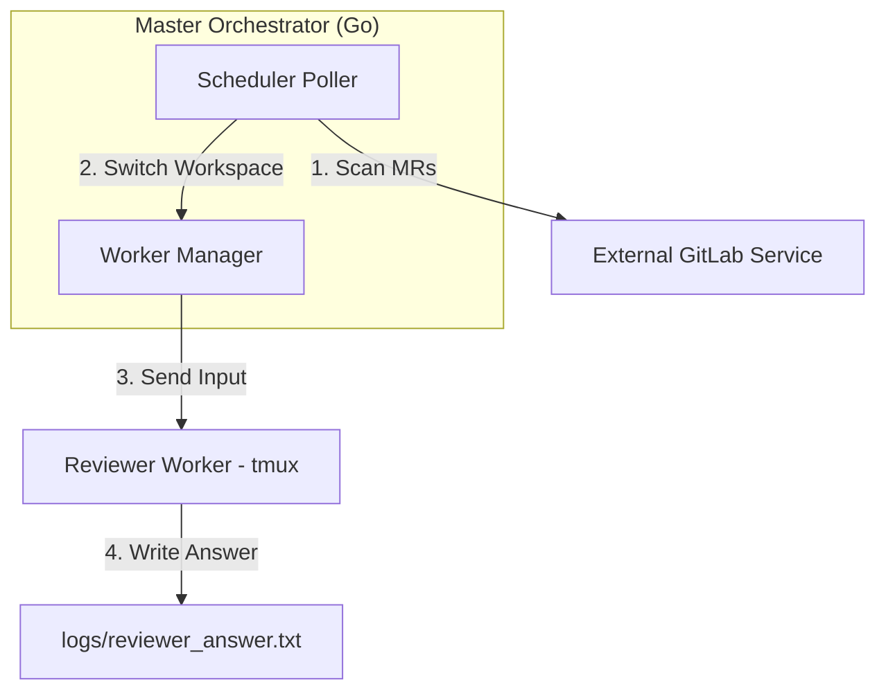

# 設計規格：本地 AI 協作編排器 (agent-flow)

## 0. 專案概述
`agent-flow` 是一個以 Go 語言開發的本地任務編排器。它主要提供了一個以 GitLab 掃描排程為核心的協同機制，配合本地的 `tmux` 會話管理器，自動將本地運作的 AI 實體 (Workers) 調配至目標工作區，並派發代碼評審 (Review) 任務。

## 1. 系統架構：定時排程與本地 Worker 管理
系統採用「排程與 Worker 驅動模型」，編排器定期掃描 GitLab Merge Requests，若符合評審標籤，則自動切換並指派本地的 Worker 執行。



## 2. GitLab 排程掃描器 (GitLab Scheduler Poller)
編排器透過背景排程執行器 (Scheduler) 定期主動掃描外部 GitLab 服務，以偵測審查任務：
- **定時掃描機制**：依據設定檔的 `scheduler.interval_seconds` 定期向 GitLab API 拉取所有處於 `opened` 狀態的 Merge Requests (MR)。
- **標記識別邏輯 (Tag Detector)**：
  - 檢查 MR 的 Title 或 Description 是否包含 `#reviewer` 關鍵字。
  - 檢查 MR 的 Reviewers 名單中是否包含當前配置的 GitLab 使用者名稱。
- **去重與更新機制 (Deduplication & SHA Watcher)**：
  - 使用記憶體維護 `processed_mrs` 映射表，記錄 `MR_IID` 與 `Last_SHA`。
  - 只有在首次發現該 MR，或是 MR 的 Commit SHA 發生變更時，才會觸發評審任務，避免重複執行。
- **本地工作空間切換與任務指派 (Workspace Switcher & Dispatcher)**：
  - 偵測到有效 MR 後，解析其 Web URL 取得專案名稱。
  - 自動掃描本地專案目錄，比對 remote origin URL，將 Reviewer Worker 的執行路徑 (Cwd/Workspace) 切換至該專案工作區。
  - 向 Worker 發送評審指令（包含 MR IID 與網址），啟動自動評審流程。

## 3. 配置範例 (config.yaml)
```yaml
logs:
  path: "./logs" 

# 定時任務排程設定
scheduler:
  enable: true
  interval_seconds: 60
  gitlab_url: "https://git.efaipd.com"

# 定義本地的協作實體
collaborators:
  - id: "reviewer"
    name: "架構評審 (Reviewer)"
    tag: "reviewer"
    cmd: "agy"
    args: []
    tags: ["reviewer", "security"]
    skills: ["gitlab-professional-reviewer"]
```

## 4. 專案價值與成功指標
- **低干擾性**：採用本地 tmux 會話，不佔用終端前台。
- **自動化閉環**：當有團隊成員在 GitLab MR 中標記評審者時，本地 AI 能全自動且即時偵測並進行 Review，大幅降低手動搬移程式碼與評審的時間。
